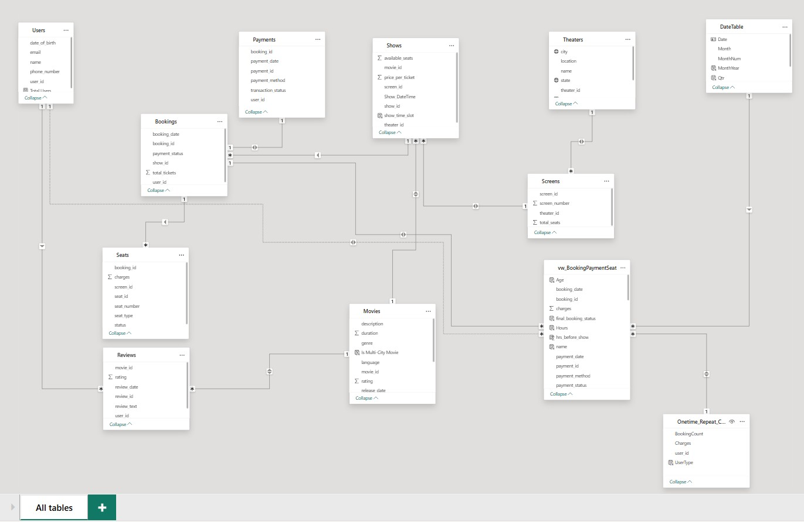

# 🎬 BookMyShow Booking & Revenue Analytics | Power BI

An interactive **Power BI dashboard project** analyzing BookMyShow-style movie ticket booking data to uncover user behavior, movie performance, theater efficiency, revenue trends, and payment analytics.

This project transforms complex transactional booking data into actionable business insights using **Power BI, Power Query, DAX, data modeling, and advanced dashboard storytelling**.

---

# 📊 Dashboard Preview

📌 Click on the image to see the working of this project as a presentation

## 🎟️ Dashboard Screenshot

[](https://www.linkedin.com/posts/moksh-kapoor-618495322_dataanalytics-powerbi-sql-activity-7445691637650857984-pnjX?utm_source=share&utm_medium=member_desktop&rcm=ACoAAFGVzjQBQzKnpNzkuOZayyyvYW4FkHnrf28)

---

## 🧩 Data Model

[](https://www.linkedin.com/posts/moksh-kapoor-618495322_dataanalytics-powerbi-sql-activity-7445691637650857984-pnjX?utm_source=share&utm_medium=member_desktop&rcm=ACoAAFGVzjQBQzKnpNzkuOZayyyvYW4FkHnrf28)

---

# 🌐 Live Interactive Dashboard

👉 **View Live Power BI Dashboard:**  

[Click Here to Open Dashboard](https://app.powerbi.com/view?r=eyJrIjoiMDVhN2UzODItNWQ4MS00YzdiLTg5NjItMzM4NDIyZDBjNmIwIiwidCI6ImIwNWJjYjBjLWVlYjgtNDMyOC05NDNkLTE1ZmVkYTE3ODBkZiJ9)

👉 **Watch Video Here:**  

[Click Here to Open Video](https://www.linkedin.com/posts/moksh-kapoor-618495322_dataanalytics-powerbi-sql-activity-7445691637650857984-pnjX?utm_source=share&utm_medium=member_desktop&rcm=ACoAAFGVzjQBQzKnpNzkuOZayyyvYW4FkHnrf28)

---

# 📁 Dataset Overview

This project analyzes a simulated **BookMyShow movie ticket booking dataset** containing **10K+ rows across multiple tables**, capturing the complete booking lifecycle across:

- Users  
- Movies  
- Theaters  
- Shows  
- Seats  
- Payments  

The dataset includes:

- User profiles & booking behavior  
- Movie metadata (genre, language, ratings, duration)  
- Theater, screen, city & state information  
- Seat categories, pricing & occupancy status  
- Booking timestamps & payment outcomes  

To enable accurate analytics, a unified **fact table** was built by combining:

- Bookings  
- Payments  
- Seats  

This helped standardize booking outcomes into:

- Successful  
- Failed  
- Invalid  

---

# 🎯 Business Problem & Analysis

Despite strong booking demand, movie ticket platforms often face:

- Revenue leakage from payment failures  
- Uneven theater performance  
- Low occupancy during certain time slots  
- User retention challenges  
- Seasonal fluctuations in booking behavior  

The objective of this project is to transform raw booking data into business insights that help stakeholders:

- Track revenue growth & booking performance  
- Monitor payment reliability  
- Analyze user engagement & retention  
- Identify high-performing movies & theaters  
- Improve occupancy & pricing strategies  

---

# 📊 Dashboard Pages

## 👥 1. User Behavior & Engagement

- Total users on the platform  
- Repeat customer percentage  
- Monthly Active Users (MAU) trends  
- Peak booking hours analysis  
- Weekend vs weekday revenue comparison  
- Age-group-wise booking behavior  
- Average tickets per booking  

---

## 🎥 2. Movie Performance Analysis

- Top movies by bookings & revenue  
- Genre & language-wise revenue contribution  
- Occupancy rate analysis  
- Top-rated movies  
- Movie duration analysis  
- Multi-city movie performance  
- QoQ booking growth trends  

---

## 🏢 3. Theater & Show Performance

- Highest & lowest revenue-generating theaters  
- Theater occupancy analysis  
- Show timing performance  
- Seat pricing impact on occupancy  
- City-wise engagement analysis  
- Theater-level booking failures  
- Average ticket pricing insights  

---

## 📈 4. Booking & Revenue Trends

- Total revenue & booking KPIs  
- Booking success rate (%)  
- MoM & YoY growth analysis  
- Seasonal demand spikes  
- Top spending users  
- State & city revenue distribution  
- Average booking value trends  

---

## 💳 5. Payment & Transaction Analysis

- Successful vs Failed vs Invalid bookings  
- Payment failure rate analysis  
- Revenue leakage tracking  
- Payment method performance  
- MoM transaction failure trends  
- Revenue impact of failed payments  

---

# 🛠️ Tools, Techniques & Concepts Used

## 🔹 Power BI

- Interactive dashboard design  
- Multi-page storytelling dashboards  
- Drill-through & slicers  
- Bookmark-based navigation  

## 🔹 Power Query

- Data cleaning & transformation  
- Handling missing values  
- Standardizing booking & payment statuses  
- Fact table creation  

## 🔹 Data Modeling

- Relationship building  
- Fact table architecture  
- Date table creation  
- Time intelligence setup  

## 🔹 DAX Measures & KPIs

- Total Revenue  
- Total Bookings  
- Booking Success Rate (%)  
- Revenue Leakage  
- Repeat Customer Rate (%)  
- Monthly Active Users (MAU)  
- MoM Growth %  
- YoY Growth %  
- Average Booking Value  

## 🔹 Advanced Visualizations

- KPI cards  
- Line charts  
- Bar & column charts  
- Stacked visuals  
- Revenue trend analysis  
- Conditional formatting tables  

---

# 📊 Key Insights & Findings

| Insight Category | Finding |
|---|---|
| Demand Trends | Booking demand shows strong seasonality |
| Peak Show Timing | Evening & Afternoon slots perform best |
| Audience Behavior | Users aged 50+ contribute high bookings |
| Revenue Drivers | Repeat users contribute major revenue share |
| Occupancy Trends | Premium seats show lower occupancy |
| Movie Revenue | Revenue concentrated among top-performing movies |
| Geographic Reach | Multi-city releases perform significantly better |
| Payment Analytics | Failed bookings create direct revenue leakage |
| Theater Performance | Revenue heavily concentrated among top theaters |
| Growth Trends | MoM payment failures fluctuate inconsistently |

---

# 💡 Strategic Recommendations

- Align promotions with seasonal demand peaks  
- Increase screen allocation for Evening & Afternoon shows  
- Introduce dynamic pricing for premium seats  
- Focus more on customer retention strategies  
- Expand high-performing movies across more cities  
- Improve underperforming theater scheduling  
- Localize payment methods by region  
- Treat payment failure rate as a core business KPI  

---

# 🔍 Key Learnings

Through this project, I strengthened my skills in:

- Power BI Dashboarding  
- Data Modeling  
- Power Query Transformations  
- DAX Calculations  
- KPI Development  
- Time Intelligence Analysis  
- Revenue Analytics  
- User Behavior Analysis  
- Business Storytelling  
- Interactive Dashboard Design  

---

# 📂 Repository Structure

```bash
bookmyshow-booking-revenue-analytics/
│
├── Datasets/
│   ├── Datasets.rar
|
├── Images/
│   ├── POWERBI P2.png
│   └── Schema.jpg
│
├── README.md
```

---

# 👤 Author

## Moksh Kapoor

📊 Aspiring Data Analyst  

### Skills
SQL • Power BI • Excel • Python

🔗 LinkedIn:  
[Visit My LinkedIn Profile](https://www.linkedin.com/in/moksh-kapoor-618495322/)

---

⭐ If you like this project, consider giving it a **star** on GitHub!
